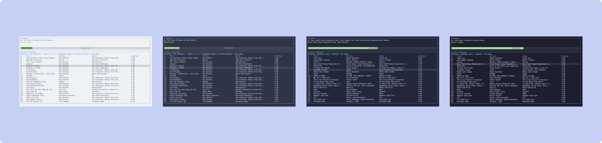

<h3 align="center">
	<br/>
	
	Catppuccin for <a href="https://github.com/aome510/spotify-player">spotify-player</a>
	
</h3>
<p align="center">
    <a href="https://github.com/catppuccin/spotify-player/stargazers"></a>
    <a href="https://github.com/catppuccin/spotify-player/issues"></a>
    <a href="https://github.com/catppuccin/spotify-player/contributors"></a>
</p>

<p align="center">
  
</p>


## Usage

1. Clone this repository locally
2. Copy the `theme.toml` from `src` to `$HOME/.config/spotify-player/`
3. Set theme option in `$HOME/.config/spotify-player/app.toml`:
    - 🌻 Catppuccin-latte
    - 🪴 Catppuccin-frappe
    - 🌺 Catppuccin-macchiato
    - 🌿 Catppuccin-mocha
4. For example to set Catppuccin-macchiato your `app.toml` should have the following line:
    ```
    theme = "Catppuccin-macchiato"
    ```

## 💝 Thanks to

-   [elkrien](https://github.com/elkrien)

&nbsp;

<p align="center"></p>
<p align="center">Copyright &copy; 2021-present <a href="https://github.com/catppuccin" target="_blank">Catppuccin Org</a>
<p align="center"><a href="https://github.com/catppuccin/catppuccin/blob/main/LICENSE"></a></p>
